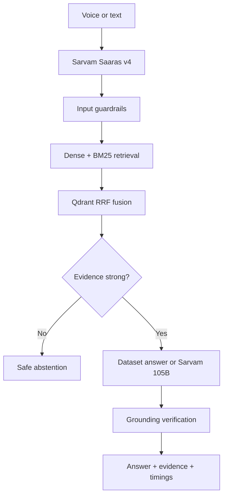

# VaaniRAG — voice-enabled RAG for HH Goa 2026

VaaniRAG is a submission-ready multilingual voice search system over
[`ai4bharat/MSMARCO-XI`](https://huggingface.co/datasets/ai4bharat/MSMARCO-XI).
It transcribes speech with Sarvam Saaras, retrieves with dense + BM25 hybrid search,
and returns a cited dataset answer—or abstains when the evidence is weak.

The repository contains two coordinated applications:

- `app/`: the deployed competition demo. It includes a small Marathi/English validation
  slice so text search remains demonstrable before secrets are configured.
- `backend/`: the full FastAPI + Qdrant system, ingestion pipeline, safeguards, tests,
  and latency benchmark harness.

## Architecture



### Non-naive chunking

Every selected passage is indexed as four complementary views:

| View | Purpose |
|---|---|
| `atomic_passage` | Keeps the complete evidence unit intact. |
| `sentence_window` | Improves precision with overlapping semantic boundaries. |
| `parent_child` | Retrieves a small child while retaining the full parent context. |
| `query_answer_anchor` | Aligns translated queries and gold answers to their evidence. |

Stable UUID5 point IDs make ingestion idempotent. Locale is indexed as a Qdrant payload
filter. English companion passages can be indexed alongside each Indic-language config.

## Run locally

Prerequisites: Docker, Docker Compose, a Sarvam API key, and roughly 2–4 GB free for a
validation-split prototype. The complete dataset is large; start with a limit.

```bash
cp .env.example .env
# Add SARVAM_API_KEY and change API_BEARER_TOKEN in .env
docker compose up -d qdrant api
docker compose run --rm ingest python scripts/ingest.py \
  --language mr --split validation --limit 2000 --recreate
curl http://localhost:8000/healthz
```

Query the service:

```bash
curl -s http://localhost:8000/v1/query \
  -H 'content-type: application/json' \
  -H 'authorization: Bearer change-me' \
  -d '{"question":"गरुड किती वेगाने प्रवास करतो?","language":"mr-IN","mode":"fast"}'
```

The voice endpoint accepts `multipart/form-data` at `/v1/voice` with fields `audio`,
`language`, and `mode`. Audio is capped at 10 MB; the browser recorder targets WebM/Opus.

## Latency: measure, do not estimate

The challenge asks for full-process latency below 200 ms and P50/P70/P100. Two modes make
that requirement testable without disguising cloud latency:

- **Fast mode** returns the exact MSMARCO-XI answer stored with the top grounded record.
  Its online path is guardrail → hybrid retrieval → verification. This is the candidate
  for the 200 ms target after embeddings and the index are warm.
- **Generative mode** uses Sarvam 105B for grounded synthesis. It is opt-in and reported
  separately because network LLM generation cannot honestly be guaranteed below 200 ms.
- **Voice measurements** include Sarvam STT. Text measurements do not. The report always
  labels which path was exercised.

Run the included 10-query suite (answerable, Marathi, off-topic, injection, unsafe, and
unanswerable cases):

```bash
cd backend
python scripts/benchmark.py \
  --url http://localhost:8000 \
  --manifest benchmark_queries.jsonl \
  --runs 10 --warmup 2 \
  --token change-me \
  --output benchmark_results.json
```

For end-to-end voice timing, add an `"audio":"/absolute/path/question.webm"` entry to the
manifest. The runner records wall-clock and server stage timings, excludes warmups, and
calculates nearest-rank P50, P70, P100 (max), and mean. Do not use submission numbers until
they were measured on the deployed configuration. See
[`docs/LATENCY_AND_EVALUATION.md`](docs/LATENCY_AND_EVALUATION.md).

## Reliability and safeguards

- Prompt-injection and unsafe-instruction screening before retrieval.
- Locale-scoped hybrid search with Qdrant reciprocal-rank fusion.
- Confidence threshold and explicit out-of-domain abstention.
- Answer-to-evidence lexical verification before release.
- One bounded Qdrant retry and three exponential-backoff STT attempts.
- Sarvam generation failure falls back to the gold dataset answer.
- Hosted front end has a circuit breaker and a small verified edge index.
- Trace IDs and per-stage latency returned in every structured response.
- Optional bearer authentication between the hosted front end and backend.

## Test

```bash
PYTHONPATH=backend python -m unittest discover -s backend/tests -v
python -m compileall backend/app backend/scripts
```

The website has its own rendered HTML smoke test via `npm test`; hosted checkpoints run
the project build validator.

## Deployment

1. Deploy `backend/` to a container host and provision Qdrant.
2. Ingest the intended languages and split before taking measurements.
3. Set `SARVAM_API_KEY`, `QDRANT_URL`, `QDRANT_API_KEY`, and `API_BEARER_TOKEN` on the API.
4. Set `RAG_BACKEND_URL`, `RAG_BACKEND_TOKEN`, and `SARVAM_API_KEY` on the hosted demo.
5. Run the benchmark against production and archive its JSON report.
6. Switch site access to public only after secrets and the production API are verified.

Do not put API keys in the repository, videos, screenshots, or browser-side JavaScript.

## Submission pack

- [`docs/SUBMISSION_CHECKLIST.md`](docs/SUBMISSION_CHECKLIST.md) — every required field,
  public-link check, team posting requirement, hashtag, and deadline.
- [`docs/VIDEO_SCRIPTS.md`](docs/VIDEO_SCRIPTS.md) — timed 90-second process and demo scripts.
- [`docs/LATENCY_AND_EVALUATION.md`](docs/LATENCY_AND_EVALUATION.md) — reproducible protocol,
  success criteria, and results table.
- [`docs/API.md`](docs/API.md) — request/response contract and error behavior.

## Official technical references

- [MSMARCO-XI dataset card](https://huggingface.co/datasets/ai4bharat/MSMARCO-XI)
- [Sarvam batch speech-to-text](https://docs.sarvam.ai/api-reference/speech-to-text/transcribe)
- [Sarvam real-time speech-to-text](https://docs.sarvam.ai/api-reference/speech-to-text/transcribe/realtime/ws)
- [Sarvam chat completions](https://docs.sarvam.ai/api-reference/chat/chat-completions)
- [Qdrant hybrid search with FastEmbed](https://qdrant.tech/documentation/tutorials-develop/hybrid-search-fastembed/)
- [Qdrant hybrid and multi-stage queries](https://qdrant.tech/documentation/search/hybrid-queries/)
